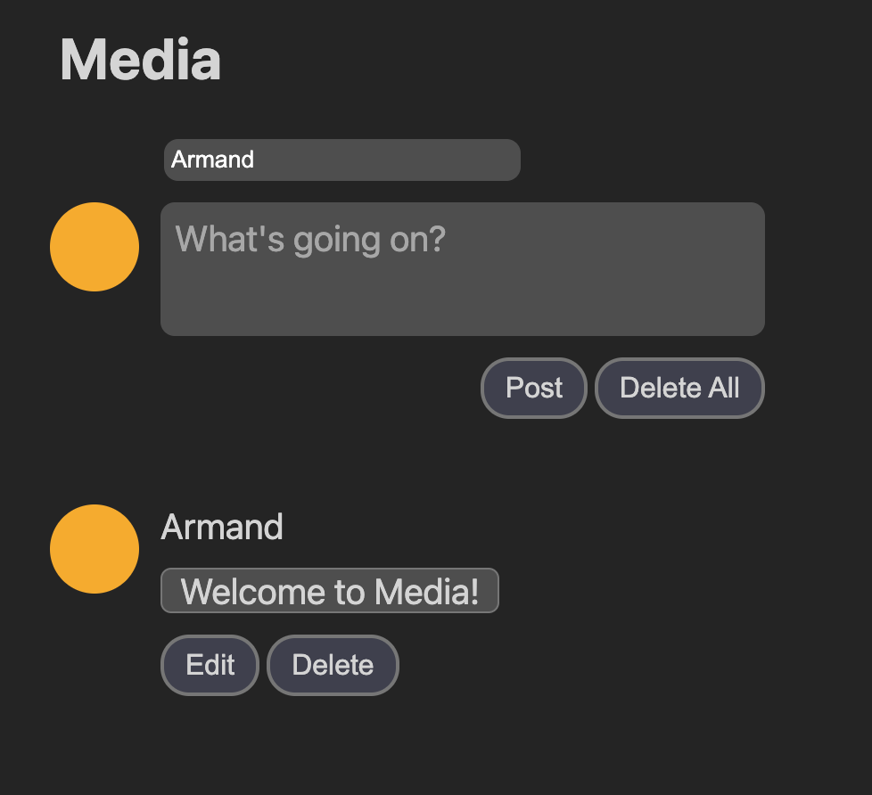

A social media website where people can post their feelings live! A full stack
web application built with React, TypeScript, node.js, and PostgreSQL. It uses
Server Sent Events (SSE), to make sure that posts come in as you make them. It's
deployed to netlify and the API is hosted on a digitalocean VPS.

Read more about how I built it in my blog post in
[the making of "Media"](/blog/media).

